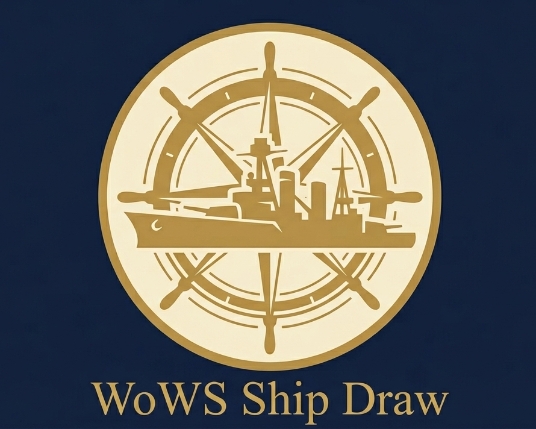

  

# WoWs Ship Draw

This web tool is designed for World of Warships players who suffer from choice paralysis — if you're staring at your port full of ships and can't decide which one to play today, just draw one randomly!

**Now supports both English and Chinese (中文) languages!**

> Unofficial fan tool. Not affiliated with or endorsed by Wargaming.net. *World of Warships* and ship names are trademarks of their respective owners.

---

## Features

- **Built-in T8–T11 Ship List** *(framework only — T8/T9/T11 entries pending)*: Covers Destroyers (DD), Cruisers (CA), Battleships (BB), Aircraft Carriers (CV), and Submarines (SS). All cruisers are labeled as CA for simplified classification.
- **Custom List**: Add your own ships by entering name, type, tier, and nation.
- **Ship Management**:
  - Uncheck → Temporarily exclude a ship (e.g., you don't want to play it today).
  - Click ❌ → Permanently remove the ship from the list (useful if you don't own it).
- **Class Exclusion**: Check "Exclude CV" or "Exclude SS" to remove aircraft carriers or submarines from the random pool.
- **Tier Filter**: Toggle which tiers (VIII / IX / X / XI) are included in the draw pool. Persists across reloads.
- **Nation Filter**: Multi-select chips for the 13 in-game nations (USA, USSR, Germany, Japan, UK, France, Italy, Pan-Asia, Pan-America, Commonwealth, Europe, Netherlands, Spain). ALL / NONE shortcuts included.
- **Grouped Roster**: The fleet list is grouped by tier (collapsible) → nation, so navigating a large pool stays manageable.
- **Reset to Default**: Click "Reset" to restore the drawing pool to the preset list.
- **Multi-language Support**: Switch between English and Chinese (中文) with the buttons in the top-right corner. Nation labels and tier numerals translate as you switch.
- **Dark Mode**: Toggle in the top-right.

## Status

The framework supports tiers VIII–XI. Currently only Tier X ships are populated — T8 / T9 / T11 entries will be added next. Existing user rosters are migrated automatically (each old ship is assigned tier 10 by default).

## How to Use

You can access this tool online via https://wows-ship-draw.vercel.app/.

The `main` branch deploys to production. Active development happens on the `dev` branch.

## Future Plans

- Populate T8 / T9 / T11 ship data
- Verify nation assignments flagged with `/* ? */` in `ships.js`
- Support filtering by premium-vs-tech-tree status
- Add "Ship Type Weight" feature for players who prefer certain ship types
- Add more languages support
